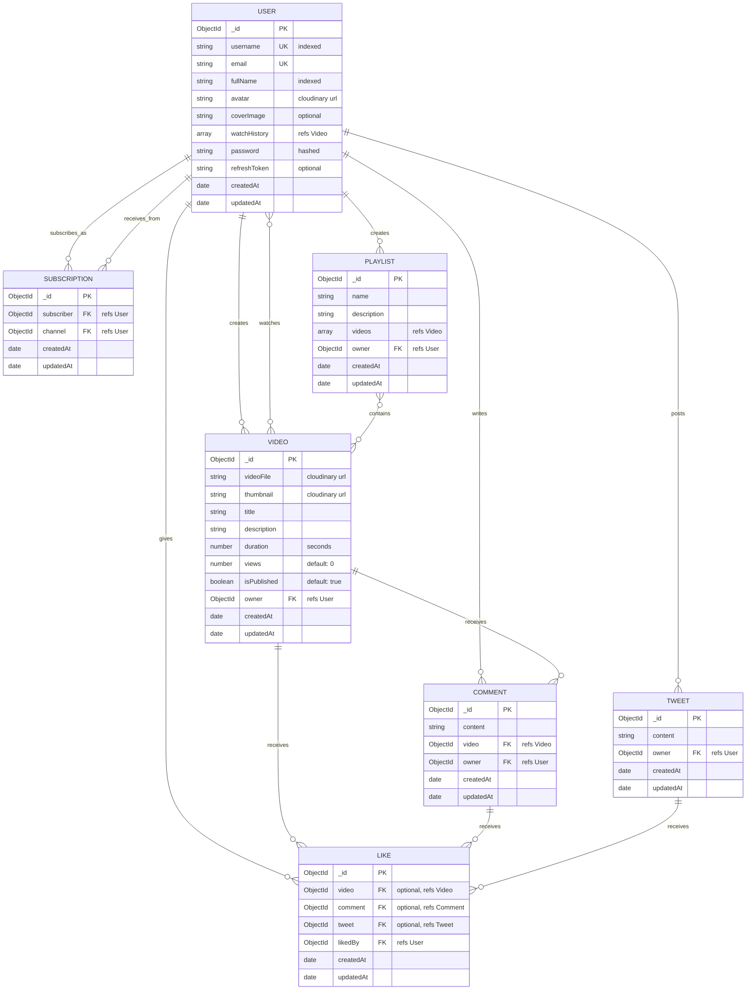

# 🚀 InTubeVideoStream: Backend Video Hosting Platform

A robust backend for a video hosting platform (YouTube-like), built with **Node.js**, **Express.js**, **MongoDB**, **Mongoose**, **JWT**, and **bcrypt**. This project demonstrates secure, scalable, and efficient backend practices for modern web applications.

---

## 🔑 Features

### User Authentication & Security
- User registration and login with **JWT** authentication
- Password hashing with **bcrypt**
- Access & Refresh tokens for secure sessions
- Middleware for authentication and authorization

### Video Management
- Upload videos with metadata (title, description, duration, etc.)
- Like, Dislike, and Comment on videos
- Reply to comments (nested comments)
- Tweet (share) videos

### User Interactions
- Subscribe/Unsubscribe to channels
- View dashboard with personalized content

### Security Features
- Secure password storage
- Helmet.js for HTTP header security
- Rate limiting middleware
- Error handling and API response standardization

### Cloud & Deployment
- Video/image storage with **Cloudinary**
- Deployed on **Azure** ([Live Demo](https://intubevideo.azurewebsites.net))

---

## 💻 Technologies Used

- 🟢 Node.js
- ⚙️ Express.js
- 🛢️ MongoDB & Mongoose
- 🔑 JWT (JSON Web Tokens)
- 🔒 bcrypt
- ⛈️ Cloudinary
- ⛑️ Helmet.js
- 🌦️ Azure
- 🧪 Postman (API Testing)

---

## 📁 Project Structure

```
├── src/
│   ├── app.js                # Express app setup
│   ├── index.js              # Entry point
│   ├── constants.js          # App constants
│   ├── controllers/          # Route controllers
│   ├── db/                   # Database connection
│   ├── middlewares/          # Auth, multer, rate limit, etc.
│   ├── models/               # Mongoose models
│   ├── routes/               # API routes
│   └── utils/                # Utilities (error handler, cloudinary, etc.)
├── public/                   # Public assets
├── log/                      # Log files
├── package.json              # Dependencies & scripts
└── Readme.md                 # Project documentation
```

---

## 🚦 API Endpoints Overview

### Auth
- `POST /api/v1/auth/signup` – Register new user
- `POST /api/v1/auth/login` – Login user
- `POST /api/v1/auth/refresh-token` – Refresh JWT token

### Videos
- `POST /api/v1/videos` – Upload video
- `GET /api/v1/videos/:id` – Get video details
- `POST /api/v1/videos/:id/like` – Like a video
- `POST /api/v1/videos/:id/dislike` – Dislike a video
- `POST /api/v1/videos/:id/comment` – Comment on a video

### Comments
- `POST /api/v1/comments/:id/reply` – Reply to a comment
- `GET /api/v1/comments/:videoId` – Get comments for a video

### User
- `GET /api/v1/users/:id` – Get user profile
- `POST /api/v1/users/:id/subscribe` – Subscribe to a user
- `POST /api/v1/users/:id/unsubscribe` – Unsubscribe from a user

### Dashboard
- `GET /api/v1/dashboard` – Personalized dashboard

> **Note:** All endpoints are protected with JWT authentication unless specified otherwise.

---

## 🛠️ Installation & Setup

1. **Clone the repository:**
   ```bash
   git clone https://github.com/pankajuday/InTubeVideoStream.git
   cd InTubeVideoStream
   ```
2. **Install dependencies:**
   ```bash
   npm install
   ```
3. **Set up environment variables:**
   - Create a `.env` file in the root directory.
   - Add the following variables:
     ```env
     PORT=5000
     MONGODB_URI=your_mongodb_connection_string
     JWT_SECRET=your_jwt_secret
     CLOUDINARY_CLOUD_NAME=your_cloud_name
     CLOUDINARY_API_KEY=your_api_key
     CLOUDINARY_API_SECRET=your_api_secret
     ```
4. **Run the server:**
   ```bash
   npm start
   ```

---

## 🧪 API Testing

- Use [Postman Collection](https://shersah.postman.co/workspace/Shersah~2cbc675f-8888-4b7b-9d44-ee0537b7eebc/collection/37155500-c5bc3b19-82e2-49cf-9e85-f31095b85714?action=share&creator=37155500&active-environment=37155500-ff418ece-aada-4824-b9a8-8641020fec88) for testing endpoints.

---

## 🤝 Contribution Guidelines

1. Fork the repository
2. Create a new branch (`git checkout -b feature/your-feature`)
3. Commit your changes (`git commit -m 'Add new feature'`)
4. Push to the branch (`git push origin feature/your-feature`)
5. Open a Pull Request

---

## 👨‍🏫 Credits

- Final project for the **Backend Development Course** by [Hitesh Choudhary](https://github.com/hiteshchoudhary) on *Chai Aur Code* YouTube channel.

---

## 📄 License

This project is licensed under the MIT License.

---

## 📊 Data Dictionary

### Database Schema Overview

This section provides detailed information about the database structure, including all collections, fields, data types, constraints, and relationships.

### Collections

#### 1. **Users Collection**
Stores user account information and authentication data.

| Field Name | Data Type | Required | Unique | Description |
|------------|-----------|----------|---------|-------------|
| `_id` | ObjectId | Yes | Yes | Primary key (auto-generated) |
| `username` | String | Yes | Yes | Unique username (lowercase, trimmed, indexed) |
| `email` | String | Yes | Yes | User email address (lowercase, trimmed) |
| `fullName` | String | Yes | No | User's full name (trimmed, indexed) |
| `avatar` | String | Yes | No | Profile picture URL (Cloudinary) |
| `coverImage` | String | No | No | Cover image URL (Cloudinary) |
| `watchHistory` | Array[ObjectId] | No | No | Array of watched video IDs (ref: Video) |
| `password` | String | Yes | No | Hashed password (bcrypt) |
| `refreshToken` | String | No | No | JWT refresh token |
| `createdAt` | Date | Yes | No | Account creation timestamp |
| `updatedAt` | Date | Yes | No | Last update timestamp |

**Indexes:** `username`, `fullName`

#### 2. **Videos Collection**
Stores video content and metadata.

| Field Name | Data Type | Required | Unique | Description |
|------------|-----------|----------|---------|-------------|
| `_id` | ObjectId | Yes | Yes | Primary key (auto-generated) |
| `videoFile` | String | Yes | No | Video file URL (Cloudinary) |
| `thumbnail` | String | Yes | No | Video thumbnail URL (Cloudinary) |
| `title` | String | Yes | No | Video title |
| `description` | String | Yes | No | Video description |
| `duration` | Number | Yes | No | Video duration in seconds |
| `views` | Number | No | No | View count (default: 0) |
| `isPublished` | Boolean | No | No | Publication status (default: true) |
| `owner` | ObjectId | Yes | No | Video owner ID (ref: User) |
| `createdAt` | Date | Yes | No | Upload timestamp |
| `updatedAt` | Date | Yes | No | Last update timestamp |

**Plugins:** `mongoose-aggregate-paginate-v2`

#### 3. **Comments Collection**
Stores comments on videos.

| Field Name | Data Type | Required | Unique | Description |
|------------|-----------|----------|---------|-------------|
| `_id` | ObjectId | Yes | Yes | Primary key (auto-generated) |
| `content` | String | Yes | No | Comment text content |
| `video` | ObjectId | Yes | No | Video ID (ref: Video) |
| `owner` | ObjectId | Yes | No | Comment author ID (ref: User) |
| `createdAt` | Date | Yes | No | Comment creation timestamp |
| `updatedAt` | Date | Yes | No | Last update timestamp |

**Plugins:** `mongoose-aggregate-paginate-v2`

#### 4. **Likes Collection**
Stores likes for videos, comments, and tweets.

| Field Name | Data Type | Required | Unique | Description |
|------------|-----------|----------|---------|-------------|
| `_id` | ObjectId | Yes | Yes | Primary key (auto-generated) |
| `video` | ObjectId | No | Yes | Liked video ID (ref: Video) |
| `comment` | ObjectId | No | Yes | Liked comment ID (ref: Comment) |
| `tweet` | ObjectId | No | Yes | Liked tweet ID (ref: Tweet) |
| `likedBy` | ObjectId | Yes | No | User who liked (ref: User) |
| `createdAt` | Date | Yes | No | Like timestamp |
| `updatedAt` | Date | Yes | No | Last update timestamp |

**Note:** Only one of `video`, `comment`, or `tweet` should be present per like record.

#### 5. **Subscriptions Collection**
Stores channel subscription relationships.

| Field Name | Data Type | Required | Unique | Description |
|------------|-----------|----------|---------|-------------|
| `_id` | ObjectId | Yes | Yes | Primary key (auto-generated) |
| `subscriber` | ObjectId | Yes | No | User who subscribes (ref: User) |
| `channel` | ObjectId | Yes | No | Channel being subscribed to (ref: User) |
| `createdAt` | Date | Yes | No | Subscription timestamp |
| `updatedAt` | Date | Yes | No | Last update timestamp |

#### 6. **Tweets Collection**
Stores tweet/post content.

| Field Name | Data Type | Required | Unique | Description |
|------------|-----------|----------|---------|-------------|
| `_id` | ObjectId | Yes | Yes | Primary key (auto-generated) |
| `content` | String | Yes | No | Tweet text content |
| `owner` | ObjectId | Yes | No | Tweet author ID (ref: User) |
| `createdAt` | Date | Yes | No | Tweet creation timestamp |
| `updatedAt` | Date | Yes | No | Last update timestamp |

#### 7. **Playlists Collection**
Stores user-created playlists.

| Field Name | Data Type | Required | Unique | Description |
|------------|-----------|----------|---------|-------------|
| `_id` | ObjectId | Yes | Yes | Primary key (auto-generated) |
| `name` | String | Yes | No | Playlist name |
| `description` | String | Yes | No | Playlist description |
| `videos` | Array[ObjectId] | No | No | Array of video IDs (ref: Video) |
| `owner` | ObjectId | Yes | No | Playlist owner ID (ref: User) |
| `createdAt` | Date | Yes | No | Creation timestamp |
| `updatedAt` | Date | Yes | No | Last update timestamp |

### Relationships

#### One-to-Many Relationships
- **User → Videos**: One user can own multiple videos
- **User → Comments**: One user can create multiple comments
- **User → Tweets**: One user can create multiple tweets
- **User → Playlists**: One user can create multiple playlists
- **Video → Comments**: One video can have multiple comments

#### Many-to-Many Relationships
- **User ↔ User (Subscriptions)**: Users can subscribe to multiple channels and have multiple subscribers
- **User ↔ Video (Likes)**: Users can like multiple videos, videos can be liked by multiple users
- **User ↔ Comment (Likes)**: Users can like multiple comments, comments can be liked by multiple users
- **User ↔ Tweet (Likes)**: Users can like multiple tweets, tweets can be liked by multiple users
- **Video ↔ Playlist**: Videos can be in multiple playlists, playlists can contain multiple videos

### Data Validation Rules

1. **Usernames**: Must be unique, lowercase, and trimmed
2. **Emails**: Must be unique, lowercase, and trimmed
3. **Passwords**: Minimum requirements enforced, automatically hashed with bcrypt
4. **Video Files**: Must be valid Cloudinary URLs
5. **Durations**: Must be positive numbers (seconds)
6. **Likes**: Each user can like each item (video/comment/tweet) only once

### Security Considerations

- Passwords are hashed using bcrypt with salt rounds of 10
- JWT tokens are used for authentication (access + refresh tokens)
- Sensitive fields like `password` and `refreshToken` should be excluded from API responses
- All timestamps are automatically managed by MongoDB

---

## 📊 Entity Relationship Diagram

Below is the Entity Relationship Diagram (ERD) for the InTubeVideoStream platform, showing all entities and their relationships:



### Legend:
- **PK**: Primary Key
- **FK**: Foreign Key
- **UK**: Unique Key
- **||--o{**: One-to-many relationship
- **}o--o{**: Many-to-many relationship
- **refs**: References (foreign key relationship to another collection)

### Key Relationships:
1. A User can create multiple Videos, Comments, Tweets, and Playlists
2. A Video can receive multiple Comments and Likes
3. Users can subscribe to other Users (channels)
4. Users can like Videos, Comments, and Tweets
5. Users can watch multiple Videos (watch history)
6. Playlists can contain multiple Videos

This ERD represents the MongoDB document structure and relationships in our application, demonstrating both embedded and referenced relationships common in NoSQL database design.

---

## 🏗️ System Architecture Diagram

Below is a system-level architecture diagram showing the major components of the InTubeVideoStream platform and how they interact:

```mermaid
erDiagram
    CLIENT {
        Frontend User_Interface
        Authentication Login_Register
        Media_Player Watch_Videos
        Forms Upload_Create
    }
    
    API_LAYER {
        Express Router
        Controllers Handler_Functions
        Middlewares Auth_RateLimit_ErrorHandler
        Response ApiResponse_ApiError
    }
    
    SERVICE_LAYER {
        Authentication JWT_Management
        Video_Management Upload_Process
        User_Management Profile_Subscription
        Interaction Like_Comment_Tweet
    }
    
    STORAGE {
        MongoDB Database
        Cloudinary Media_Storage
        LocalStorage Temporary_Files
    }
    
    SECURITY {
        JWT Authentication
        bcrypt Password_Hashing
        Helmet HTTP_Headers
        RateLimit Request_Throttling
    }

    CLIENT ||--|| API_LAYER : "HTTP Requests"
    API_LAYER ||--|| SERVICE_LAYER : "Business Logic"
    SERVICE_LAYER ||--|| STORAGE : "Data Operations"
    API_LAYER ||--|| SECURITY : "Secures"
    SERVICE_LAYER ||--|| SECURITY : "Implements"
}
```

### System Components:

1. **Client Layer**:
   - User interface elements for video browsing, playback, and account management
   - Authentication forms for login and registration
   - Media player for video consumption
   - Forms for video uploads, comments, and other content creation

2. **API Layer**:
   - Express.js routes handling HTTP endpoints
   - Controllers implementing request handling logic
   - Middlewares for authentication, rate limiting, and error handling
   - Standard response patterns using ApiResponse and ApiError utilities

3. **Service Layer**:
   - Core business logic for authentication, video management, and user interactions
   - JWT token management for secure sessions
   - Video processing and management services
   - User profile and subscription management

4. **Storage Layer**:
   - MongoDB for structured data storage (users, videos metadata, comments, likes)
   - Cloudinary for media file storage (videos, thumbnails, avatars)
   - Local storage for temporary file handling

5. **Security Layer**:
   - JWT-based authentication and authorization
   - Password hashing with bcrypt
   - Helmet.js for secure HTTP headers
   - Rate limiting to prevent abuse

This architectural view shows how the different system components interact to provide the full functionality of the InTubeVideoStream platform.

---

## 💡 Project Highlights

- Demonstrates secure authentication, scalable architecture, and best practices for backend development.
- Modular codebase for easy maintenance and extension.
- Ready for cloud deployment and production use.

---

For any questions or support, please open an issue or contact the maintainer.
