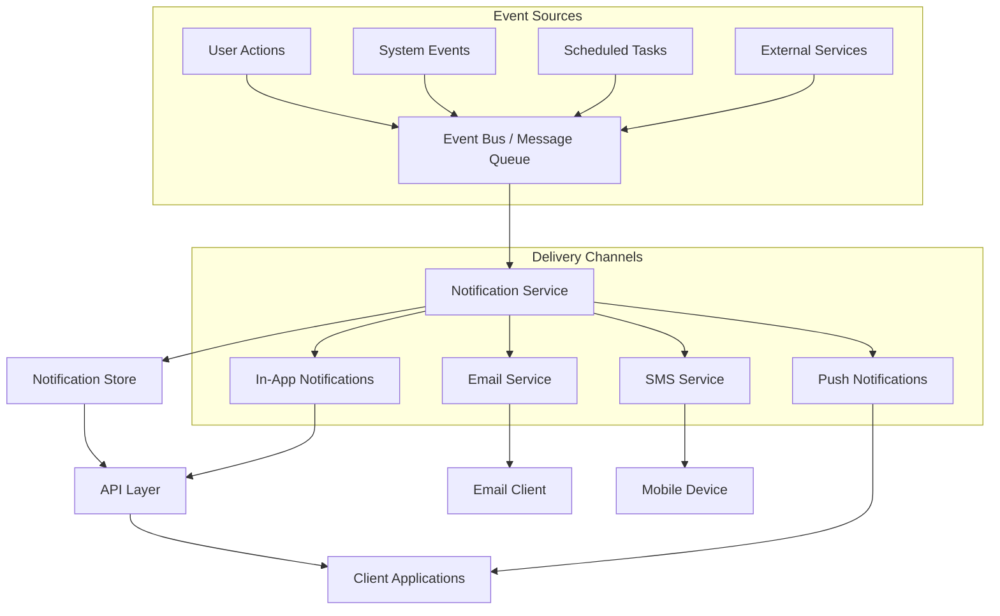
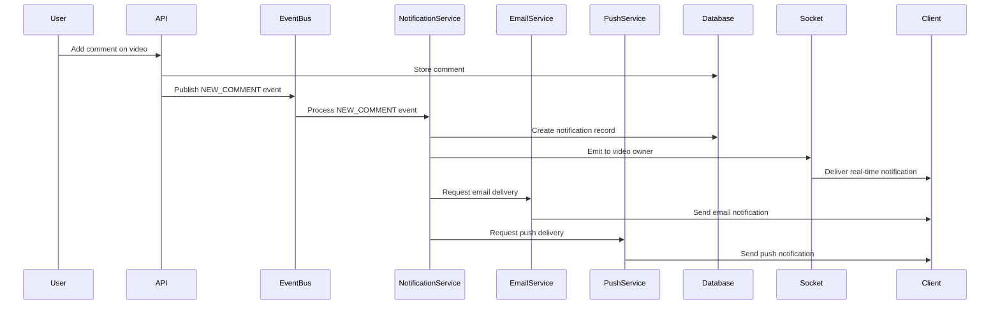
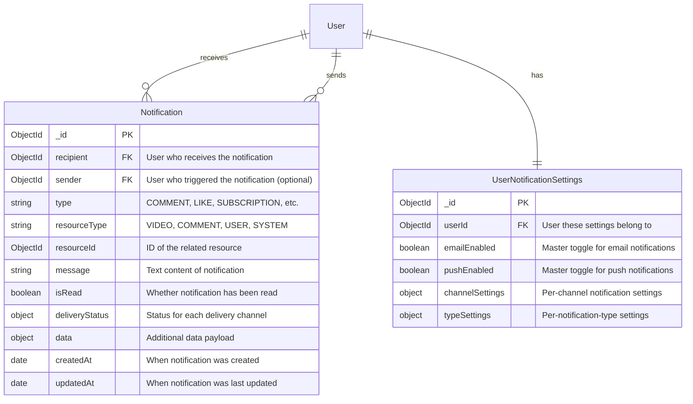
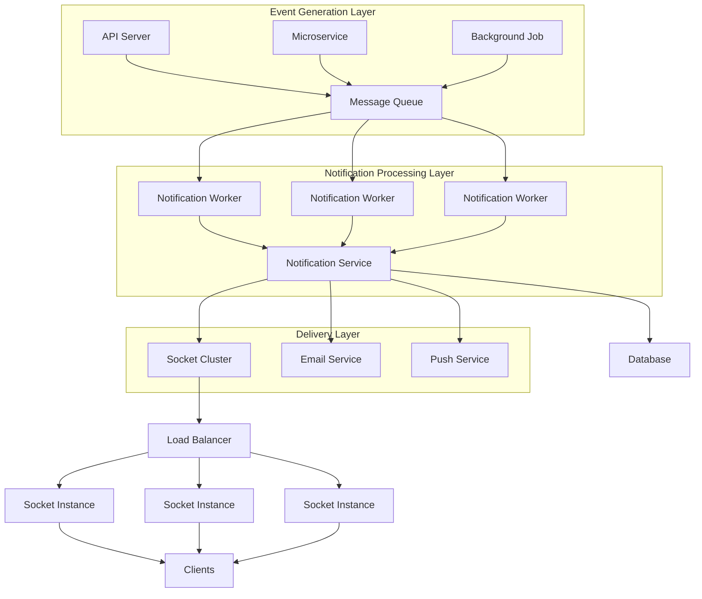

# Comprehensive Guide to Notification Systems

This document provides a complete overview of notification systems for web and mobile applications, covering architecture, implementation strategies, real-time communications, event-driven design, and practical examples.

## Table of Contents

- [1. Notification System Architecture](#1-notification-system-architecture)
- [2. When & How to Use Socket.io vs WebRTC](#2-when--how-to-use-socketio-vs-webrtc)
- [3. Event-Driven Architecture Principles](#3-event-driven-architecture-principles)
- [4. Database Design for Notifications](#4-database-design-for-notifications)
- [5. Frontend Implementation](#5-frontend-implementation)
- [6. Scaling Notification Systems](#6-scaling-notification-systems)
- [7. Best Practices & Common Patterns](#7-best-practices--common-patterns)
- [8. Practical Implementation Steps](#8-practical-implementation-steps)

## 1. Notification System Architecture

### High-Level Architecture Diagram



### Components Breakdown

1. **Event Sources**
   - User actions (comments, likes, follows)
   - System events (video processing completed)
   - Scheduled tasks (weekly digests)
   - External service webhooks

2. **Event Bus / Message Queue**
   - Central hub that receives and routes events
   - Examples: Redis Pub/Sub, RabbitMQ, Apache Kafka

3. **Notification Service**
   - Core service that processes events and generates notifications
   - Applies user preferences and filtering rules
   - Determines delivery channels

4. **Notification Store**
   - Database that persists notification data
   - Tracks read/unread status
   - Stores notification history

5. **Delivery Channels**
   - In-app notifications (real-time via WebSockets)
   - Push notifications (web/mobile)
   - Email notifications
   - SMS notifications

## 2. When & How to Use Socket.io vs WebSockets

### Socket.io

#### When to use Socket.io:
- Real-time notifications and alerts
- Live chat features
- Activity feeds
- Status updates (online/offline)
- Live data updates (counters, feeds)
- When you need automatic reconnection handling
- When you need support for fallback mechanisms (polling)
- When you need room-based broadcasting

#### How to implement Socket.io for notifications:

**Server-side Setup:**

```javascript
// server.js
import { createServer } from "http";
import express from "express";
import { Server } from "socket.io";

const app = express();
const httpServer = createServer(app);
const io = new Server(httpServer, {
  cors: {
    origin: "http://your-frontend-domain.com",
    methods: ["GET", "POST"]
  }
});

// Authentication middleware for sockets
io.use((socket, next) => {
  const token = socket.handshake.auth.token;
  // Verify JWT token
  if (isValidToken(token)) {
    socket.userId = getUserIdFromToken(token);
    next();
  } else {
    next(new Error("Authentication error"));
  }
});

// Handle connections
io.on("connection", (socket) => {
  console.log(`User connected: ${socket.userId}`);
  
  // Join user-specific room
  socket.join(`user:${socket.userId}`);
  
  socket.on("disconnect", () => {
    console.log(`User disconnected: ${socket.userId}`);
  });
});

// Function to send notification to specific user
export function sendNotificationToUser(userId, notification) {
  io.to(`user:${userId}`).emit("notification", notification);
}

httpServer.listen(3000, () => {
  console.log("Server is running on port 3000");
});
```

**Client-side Integration:**

```javascript
// In your frontend React/Vue/Angular app
import { io } from "socket.io-client";

// Initialize socket connection
function initializeSocket(authToken) {
  const socket = io("http://your-api-server.com", {
    auth: { token: authToken }
  });
  
  // Connection events
  socket.on("connect", () => {
    console.log("Connected to notification service");
  });
  
  socket.on("disconnect", () => {
    console.log("Disconnected from notification service");
  });
  
  // Listen for notifications
  socket.on("notification", (notification) => {
    // Update UI with new notification
    showNotification(notification);
    // Update notification badge count
    updateNotificationCount();
  });
  
  return socket;
}
```

### Native WebSockets

#### When to use Native WebSockets:
- When you need a lightweight solution without extra features
- When you want to minimize dependencies
- When performance is absolutely critical
- When you want to follow standard web protocols directly
- When you need to implement custom reconnection or room logic

**Server-side Setup:**

```javascript
// websocket-server.js
import { createServer } from "http";
import express from "express";
import { WebSocketServer } from "ws";
import jwt from "jsonwebtoken";

const app = express();
const server = createServer(app);
const wss = new WebSocketServer({ server });

// Store active connections
const clients = new Map();

// Handle connections
wss.on("connection", (ws, req) => {
  let userId = null;
  
  // Parse token from query string
  const url = new URL(req.url, 'http://localhost');
  const token = url.searchParams.get('token');
  
  try {
    // Verify token
    const decoded = jwt.verify(token, process.env.JWT_SECRET);
    userId = decoded.userId;
    
    // Store connection with user id
    clients.set(userId, ws);
    console.log(`User ${userId} connected`);
    
    // Send welcome message
    ws.send(JSON.stringify({
      type: 'connection_successful',
      data: { message: 'Connected to notification service' }
    }));
  } catch (error) {
    console.error("Authentication failed:", error);
    ws.close(1008, "Authentication failed");
    return;
  }
  
  // Handle messages from client
  ws.on("message", (data) => {
    try {
      const message = JSON.parse(data);
      console.log(`Received message from ${userId}:`, message);
      // Process message...
    } catch (error) {
      console.error("Failed to parse message:", error);
    }
  });
  
  // Handle disconnection
  ws.on("close", () => {
    if (userId) {
      clients.delete(userId);
      console.log(`User ${userId} disconnected`);
    }
  });
  
  // Handle errors
  ws.on("error", (error) => {
    console.error(`WebSocket error for user ${userId}:`, error);
    clients.delete(userId);
  });
});

// Function to send notification to specific user
function sendNotificationToUser(userId, notification) {
  const client = clients.get(userId);
  if (client && client.readyState === WebSocket.OPEN) {
    client.send(JSON.stringify({
      type: 'notification',
      data: notification
    }));
    return true;
  }
  return false;
}

server.listen(3000, () => {
  console.log("WebSocket server is running on port 3000");
});
```

**Client-side Integration:**

```javascript
// In your frontend code
function initializeWebSocket(authToken) {
  // Create WebSocket connection with auth token
  const ws = new WebSocket(`ws://your-api-server.com/notifications?token=${authToken}`);
  
  // Connection opened
  ws.addEventListener('open', (event) => {
    console.log('Connected to notification service');
  });
  
  // Listen for messages
  ws.addEventListener('message', (event) => {
    try {
      const message = JSON.parse(event.data);
      
      if (message.type === 'notification') {
        // Handle notification
        showNotification(message.data);
        updateNotificationCount();
      }
    } catch (error) {
      console.error('Failed to parse message:', error);
    }
  });
  
  // Handle disconnection
  ws.addEventListener('close', (event) => {
    console.log('Disconnected from notification service:', event.code, event.reason);
    
    // Implement reconnection logic
    if (event.code !== 1008) { // Not authentication failure
      setTimeout(() => {
        console.log('Attempting to reconnect...');
        initializeWebSocket(authToken);
      }, 3000);
    }
  });
  
  // Handle errors
  ws.addEventListener('error', (event) => {
    console.error('WebSocket error:', event);
  });
  
  return ws;
}
```

**Note:** Native WebSockets provide a more lightweight solution compared to Socket.io but require manual implementation of features like reconnection, rooms, and fallback mechanisms that Socket.io provides out of the box.

## 3. Event-Driven Architecture Principles

### Key Concepts

1. **Events** - Immutable facts about something that happened
2. **Event Producers** - Services that generate events
3. **Event Consumers** - Services that react to events
4. **Event Bus/Broker** - Infrastructure that routes events

### Event-Driven Architecture Diagram



### Backend Implementation

**1. Event Definition:**

```javascript
// events/types.js
export const EVENT_TYPES = {
  NEW_SUBSCRIPTION: 'NEW_SUBSCRIPTION',
  NEW_VIDEO: 'NEW_VIDEO',
  NEW_COMMENT: 'NEW_COMMENT',
  NEW_LIKE: 'NEW_LIKE',
  VIDEO_PROCESSED: 'VIDEO_PROCESSED',
  // ... other event types
};
```

**2. Event Emitter Implementation:**

```javascript
// events/eventEmitter.js
import EventEmitter from 'events';
import { EVENT_TYPES } from './types.js';

// Create singleton event emitter
class AppEventEmitter extends EventEmitter {}
const eventEmitter = new AppEventEmitter();

// Export function to emit events
export function emitEvent(eventType, data) {
  console.log(`Event emitted: ${eventType}`, data);
  eventEmitter.emit(eventType, data);
}

export default eventEmitter;
```

**3. Event Consumer Implementation:**

```javascript
// events/notificationEventHandlers.js
import eventEmitter from './eventEmitter.js';
import { EVENT_TYPES } from './types.js';
import NotificationService from '../services/notification.service.js';

// Register event handlers
function registerEventHandlers() {
  // Handle new comment events
  eventEmitter.on(EVENT_TYPES.NEW_COMMENT, async (data) => {
    const { videoId, commentId, authorId, videoOwnerId, commentText } = data;
    
    // Create notification for video owner
    if (authorId !== videoOwnerId) {
      await NotificationService.createNotification({
        recipient: videoOwnerId,
        sender: authorId,
        type: 'COMMENT',
        resourceId: videoId,
        resourceType: 'VIDEO',
        message: `New comment on your video: "${commentText.substring(0, 50)}..."`,
      });
    }
  });
  
  // Handle new subscription events
  eventEmitter.on(EVENT_TYPES.NEW_SUBSCRIPTION, async (data) => {
    const { subscriberId, subscriberName, channelId } = data;
    
    await NotificationService.createNotification({
      recipient: channelId,
      sender: subscriberId,
      type: 'SUBSCRIPTION',
      resourceId: subscriberId,
      resourceType: 'USER',
      message: `${subscriberName} subscribed to your channel!`,
    });
  });
  
  // Add other event handlers...
}

export default { registerEventHandlers };
```

**4. Emitting Events:**

```javascript
// controllers/comment.controller.js
import { emitEvent } from '../events/eventEmitter.js';
import { EVENT_TYPES } from '../events/types.js';

export const addComment = async (req, res) => {
  try {
    const { videoId, content } = req.body;
    const userId = req.user._id;
    
    // Create comment in database
    const comment = await Comment.create({
      video: videoId,
      content,
      owner: userId
    });
    
    // Get video details to find owner
    const video = await Video.findById(videoId);
    
    // Emit comment event
    emitEvent(EVENT_TYPES.NEW_COMMENT, {
      videoId,
      commentId: comment._id,
      authorId: userId,
      videoOwnerId: video.owner,
      commentText: content
    });
    
    return res.status(201).json(comment);
  } catch (error) {
    console.error("Error adding comment:", error);
    return res.status(500).json({ error: "Failed to add comment" });
  }
};
```

### Frontend Implementation for Event-Driven Architecture

**1. Using Context for Notifications:**

```jsx
// contexts/NotificationContext.js
import React, { createContext, useContext, useState, useEffect } from 'react';
import io from 'socket.io-client';

const NotificationContext = createContext();

export function NotificationProvider({ children }) {
  const [notifications, setNotifications] = useState([]);
  const [unreadCount, setUnreadCount] = useState(0);
  const [socket, setSocket] = useState(null);
  
  // Initialize socket connection
  useEffect(() => {
    const token = localStorage.getItem('token');
    if (!token) return;
    
    const socketInstance = io('http://your-api.com', {
      auth: { token }
    });
    
    socketInstance.on('connect', () => {
      console.log('Connected to notification service');
    });
    
    socketInstance.on('notification', (notification) => {
      setNotifications(prev => [notification, ...prev]);
      setUnreadCount(count => count + 1);
      
      // Show browser notification if allowed
      if (Notification.permission === 'granted') {
        new Notification(notification.message, {
          icon: '/logo.png'
        });
      }
    });
    
    setSocket(socketInstance);
    
    return () => {
      socketInstance.disconnect();
    };
  }, []);
  
  // Function to mark notification as read
  const markAsRead = async (notificationId) => {
    try {
      await fetch(`/api/notifications/${notificationId}/read`, {
        method: 'PATCH',
        headers: {
          'Content-Type': 'application/json',
          'Authorization': `Bearer ${localStorage.getItem('token')}`
        }
      });
      
      // Update local state
      setNotifications(notifications.map(n => 
        n._id === notificationId ? {...n, isRead: true} : n
      ));
      
      setUnreadCount(Math.max(0, unreadCount - 1));
    } catch (error) {
      console.error('Failed to mark notification as read', error);
    }
  };
  
  return (
    <NotificationContext.Provider value={{
      notifications,
      unreadCount,
      markAsRead
    }}>
      {children}
    </NotificationContext.Provider>
  );
}

export const useNotifications = () => useContext(NotificationContext);
```

**2. Notification Components:**

```jsx
// components/NotificationBell.jsx
import React from 'react';
import { useNotifications } from '../contexts/NotificationContext';

function NotificationBell() {
  const { unreadCount } = useNotifications();
  
  return (
    <div className="notification-bell">
      <i className="bell-icon"></i>
      {unreadCount > 0 && (
        <span className="notification-badge">{unreadCount}</span>
      )}
    </div>
  );
}

// components/NotificationDropdown.jsx
function NotificationDropdown() {
  const { notifications, markAsRead } = useNotifications();
  
  return (
    <div className="notification-dropdown">
      <h3>Notifications</h3>
      <div className="notification-list">
        {notifications.length === 0 ? (
          <p>No notifications yet</p>
        ) : (
          notifications.map(notification => (
            <div 
              key={notification._id} 
              className={`notification-item ${notification.isRead ? '' : 'unread'}`}
              onClick={() => markAsRead(notification._id)}
            >
              <div className="notification-avatar">
                
              </div>
              <div className="notification-content">
                <p>{notification.message}</p>
                <span className="notification-time">
                  {formatTimeAgo(notification.createdAt)}
                </span>
              </div>
            </div>
          ))
        )}
      </div>
    </div>
  );
}
```

## 4. Database Design for Notifications

### Schema Design for MongoDB

```javascript
// Notification Schema
const notificationSchema = new mongoose.Schema({
  // Who should receive this notification
  recipient: {
    type: mongoose.Schema.Types.ObjectId,
    ref: 'User',
    required: true,
    index: true // Important for query performance
  },
  
  // Who triggered this notification (optional, could be system)
  sender: {
    type: mongoose.Schema.Types.ObjectId,
    ref: 'User'
  },
  
  // Type of notification
  type: {
    type: String,
    enum: [
      'COMMENT',
      'LIKE',
      'SUBSCRIPTION',
      'VIDEO_UPLOAD',
      'MENTION',
      'SYSTEM'
    ],
    required: true,
    index: true // For filtering by type
  },
  
  // Related resource
  resourceType: {
    type: String,
    enum: ['VIDEO', 'COMMENT', 'USER', 'SYSTEM'],
    required: true
  },
  
  resourceId: {
    type: mongoose.Schema.Types.ObjectId,
    required: true
  },
  
  // Notification content
  message: {
    type: String,
    required: true
  },
  
  // Read status
  isRead: {
    type: Boolean,
    default: false,
    index: true // Important for unread queries
  },
  
  // Delivery status for different channels
  deliveryStatus: {
    inApp: {
      delivered: { type: Boolean, default: false },
      timestamp: Date
    },
    email: {
      delivered: { type: Boolean, default: false },
      timestamp: Date
    },
    push: {
      delivered: { type: Boolean, default: false },
      timestamp: Date
    }
  },
  
  // Optional data payload for extra information
  data: {
    type: mongoose.Schema.Types.Mixed
  }
}, 
{
  timestamps: true
});

// Add compound indexes for common queries
notificationSchema.index({ recipient: 1, createdAt: -1 }); // For user's notification feed
notificationSchema.index({ recipient: 1, isRead: 1 }); // For unread counts
```

### Database Schema Visualization



### Query Patterns for Notifications

**1. Get User's Notification Feed:**

```javascript
const getUserNotifications = async (userId, page = 1, limit = 20) => {
  const skip = (page - 1) * limit;
  
  const notifications = await Notification.find({ recipient: userId })
    .sort({ createdAt: -1 })
    .skip(skip)
    .limit(limit)
    .populate('sender', 'username avatar')
    .lean();
    
  return notifications;
};
```

**2. Get Unread Count:**

```javascript
const getUnreadCount = async (userId) => {
  return await Notification.countDocuments({
    recipient: userId,
    isRead: false
  });
};
```

**3. Mark Notifications as Read:**

```javascript
// Mark single notification as read
const markAsRead = async (notificationId, userId) => {
  return await Notification.findOneAndUpdate(
    { _id: notificationId, recipient: userId },
    { isRead: true },
    { new: true }
  );
};

// Mark all notifications as read
const markAllAsRead = async (userId) => {
  return await Notification.updateMany(
    { recipient: userId, isRead: false },
    { isRead: true }
  );
};
```

## 5. Frontend Implementation

### Notification Components

**1. Notification Context Provider:**
(See earlier section on Frontend Implementation for Event-Driven Architecture)

**2. Notification UI Components:**

```jsx
// Notification Bell with Badge
function NotificationBell({ onClick }) {
  const { unreadCount } = useNotifications();
  
  return (
    <button className="notification-bell" onClick={onClick}>
      <svg className="bell-icon" width="24" height="24" viewBox="0 0 24 24">
        <path d="M12 22c1.1 0 2-.9 2-2h-4c0 1.1.9 2 2 2zm6-6v-5c0-3.07-1.63-5.64-4.5-6.32V4c0-.83-.67-1.5-1.5-1.5s-1.5.67-1.5 1.5v.68C7.64 5.36 6 7.92 6 11v5l-2 2v1h16v-1l-2-2zm-2 1H8v-6c0-2.48 1.51-4.5 4-4.5s4 2.02 4 4.5v6z" />
      </svg>
      {unreadCount > 0 && (
        <span className="notification-badge">{unreadCount}</span>
      )}
    </button>
  );
}
```

**3. Notification Center:**

```jsx
function NotificationCenter() {
  const { notifications, markAsRead, markAllAsRead } = useNotifications();
  
  return (
    <div className="notification-center">
      <div className="notification-header">
        <h3>Notifications</h3>
        {notifications.some(n => !n.isRead) && (
          <button onClick={markAllAsRead} className="mark-all-read">
            Mark all as read
          </button>
        )}
      </div>
      
      <div className="notification-list">
        {notifications.length === 0 ? (
          <div className="empty-state">
            <p>No notifications yet</p>
          </div>
        ) : (
          notifications.map(notification => (
            <NotificationItem 
              key={notification._id}
              notification={notification}
              onRead={() => markAsRead(notification._id)}
            />
          ))
        )}
      </div>
    </div>
  );
}
```

**4. Notification Item Component:**

```jsx
function NotificationItem({ notification, onRead }) {
  // Format timeAgo (e.g., "2 minutes ago")
  const timeAgo = formatDistanceToNow(new Date(notification.createdAt), {
    addSuffix: true
  });
  
  // Get appropriate icon based on notification type
  const getIconForType = (type) => {
    switch (type) {
      case 'COMMENT': return 'comment-icon';
      case 'LIKE': return 'heart-icon';
      case 'SUBSCRIPTION': return 'user-plus-icon';
      case 'VIDEO_UPLOAD': return 'video-icon';
      default: return 'bell-icon';
    }
  };
  
  return (
    <div 
      className={`notification-item ${notification.isRead ? '' : 'unread'}`}
      onClick={onRead}
    >
      {notification.sender && (
        <div className="notification-avatar">
          
        </div>
      )}
      
      <div className="notification-content">
        <div className="notification-icon">
          <i className={getIconForType(notification.type)}></i>
        </div>
        
        <div className="notification-text">
          <p>{notification.message}</p>
          <span className="notification-time">{timeAgo}</span>
        </div>
      </div>
    </div>
  );
}
```

### Notification Styling (CSS)

```css
/* Notification Bell */
.notification-bell {
  position: relative;
  cursor: pointer;
  background: none;
  border: none;
  padding: 8px;
}

.notification-badge {
  position: absolute;
  top: 0;
  right: 0;
  background-color: #ff4a4a;
  color: white;
  border-radius: 50%;
  width: 18px;
  height: 18px;
  font-size: 12px;
  display: flex;
  align-items: center;
  justify-content: center;
}

/* Notification Center */
.notification-center {
  width: 350px;
  max-height: 500px;
  background-color: white;
  border-radius: 8px;
  box-shadow: 0 5px 15px rgba(0,0,0,0.1);
  overflow: hidden;
}

.notification-header {
  display: flex;
  justify-content: space-between;
  align-items: center;
  padding: 16px;
  border-bottom: 1px solid #f0f0f0;
}

.notification-list {
  overflow-y: auto;
  max-height: 450px;
}

/* Notification Item */
.notification-item {
  display: flex;
  padding: 12px 16px;
  border-bottom: 1px solid #f5f5f5;
  cursor: pointer;
  transition: background-color 0.2s;
}

.notification-item:hover {
  background-color: #f9f9f9;
}

.notification-item.unread {
  background-color: #f0f7ff;
}

.notification-avatar {
  width: 40px;
  height: 40px;
  margin-right: 12px;
}

.notification-avatar img {
  width: 100%;
  height: 100%;
  border-radius: 50%;
  object-fit: cover;
}

.notification-content {
  flex: 1;
  display: flex;
}

.notification-icon {
  margin-right: 10px;
  color: #4a90e2;
}

.notification-text p {
  margin: 0 0 5px 0;
  font-size: 14px;
}

.notification-time {
  color: #888;
  font-size: 12px;
}

.empty-state {
  padding: 32px;
  text-align: center;
  color: #888;
}
```

### Browser Push Notifications

```javascript
// Request permission for browser notifications
const requestNotificationPermission = async () => {
  if (!('Notification' in window)) {
    alert('This browser does not support desktop notifications');
    return false;
  }
  
  if (Notification.permission === 'granted') {
    return true;
  }
  
  if (Notification.permission !== 'denied') {
    const permission = await Notification.requestPermission();
    return permission === 'granted';
  }
  
  return false;
};

// Show browser notification
const showBrowserNotification = (title, options = {}) => {
  if (Notification.permission === 'granted') {
    const notification = new Notification(title, {
      icon: '/app-icon.png',
      badge: '/notification-badge.png',
      ...options
    });
    
    notification.onclick = function() {
      window.focus();
      if (options.url) {
        window.location.href = options.url;
      }
      this.close();
    };
    
    return notification;
  }
  
  return null;
};
```

## 6. Scaling Notification Systems

### Scaling Challenges

1. **High Volume:** Popular platforms may need to process millions of notifications daily
2. **Delivery Guarantees:** Ensuring notifications reach recipients reliably
3. **Real-time Requirements:** Maintaining low latency at scale
4. **State Management:** Tracking notification state across distributed systems

### Scaling Architecture



### Key Technologies for Scaling

1. **Message Queues:**
   - RabbitMQ
   - Apache Kafka
   - Redis Streams

2. **Socket.io Scaling:**
   - Redis Adapter
   - Sticky Sessions
   - Horizontal scaling with load balancers
   - MongoDB Adapter (alternative to Redis)

3. **Database Optimization:**
   - Time-based sharding
   - Read replicas
   - Materialized views for counts

### Code Example: Scalable Socket.io with Redis Adapter

```javascript
// server.js
import { createServer } from "http";
import express from "express";
import { Server } from "socket.io";
import { createAdapter } from "@socket.io/redis-adapter";
import { createClient } from "redis";

const app = express();
const httpServer = createServer(app);

// Redis clients for Socket.io adapter
const pubClient = createClient({ url: process.env.REDIS_URL });
const subClient = pubClient.duplicate();

// Create Socket.io server with Redis adapter
const io = new Server(httpServer, {
  adapter: createAdapter(pubClient, subClient),
  cors: {
    origin: process.env.FRONTEND_URL,
    methods: ["GET", "POST"]
  }
});

// Socket.io connection handling
io.on("connection", (socket) => {
  // Authentication and room setup
  const userId = socket.handshake.auth.userId;
  if (userId) {
    socket.join(`user:${userId}`);
  }
});

// Function to send notification via Socket.io
// Can be called from any server instance
export async function sendNotificationToUser(userId, notification) {
  io.to(`user:${userId}`).emit("notification", notification);
}

httpServer.listen(3000);
```

### Code Example: Scalable Socket.io with MongoDB Adapter

```javascript
// server.js
import { createServer } from "http";
import express from "express";
import { Server } from "socket.io";
import { createAdapter } from "@socket.io/mongodb-adapter";
import { MongoClient } from "mongodb";

const app = express();
const httpServer = createServer(app);

// MongoDB connection setup
const mongoClient = new MongoClient(process.env.MONGODB_URI);

async function initializeSocketServer() {
  try {
    // Connect to MongoDB
    await mongoClient.connect();
    
    // Get MongoDB database and collection for Socket.io
    const db = mongoClient.db(process.env.DB_NAME || "notifications");
    const collection = db.collection("socket.io-adapter-events");
    
    // Create MongoDB adapter for Socket.io
    const mongoAdapter = createAdapter(collection);
    
    // Create Socket.io server with MongoDB adapter
    const io = new Server(httpServer, {
      adapter: mongoAdapter,
      cors: {
        origin: process.env.FRONTEND_URL,
        methods: ["GET", "POST"]
      }
    });
    
    // Socket.io connection handling
    io.on("connection", (socket) => {
      // Authentication and room setup
      const userId = socket.handshake.auth.userId;
      if (userId) {
        socket.join(`user:${userId}`);
        console.log(`User ${userId} connected`);
      }
      
      socket.on("disconnect", () => {
        if (userId) {
          console.log(`User ${userId} disconnected`);
        }
      });
    });
    
    // Function to send notification to specific user
    // Can be called from any server instance
    global.sendNotificationToUser = function(userId, notification) {
      io.to(`user:${userId}`).emit("notification", notification);
    };
    
    return io;
  } catch (error) {
    console.error("Failed to initialize Socket.io with MongoDB adapter:", error);
    throw error;
  }
}

// Initialize the Socket.io server
initializeSocketServer()
  .then(() => {
    httpServer.listen(3000, () => {
      console.log("Server is running on port 3000");
    });
  })
  .catch((err) => {
    console.error("Failed to start server:", err);
    process.exit(1);
  });
```

#### Benefits of Using MongoDB Adapter vs Redis Adapter

1. **Unified Database Infrastructure**: If your application already uses MongoDB, you can simplify your tech stack by using MongoDB for Socket.io scaling as well, eliminating the need to manage Redis as a separate system.

2. **Persistence**: MongoDB provides better persistence than Redis (unless Redis is configured with persistence). This means your Socket.io state can survive server restarts without data loss.

3. **Automatic Scalability**: MongoDB's built-in sharding capabilities make it easier to scale horizontally as your application grows.

4. **Familiar Query Language**: If your team is already familiar with MongoDB's query language, there's no need to learn Redis commands for debugging and monitoring.

5. **TTL Indexes**: MongoDB's TTL (Time-To-Live) indexes can automatically clean up old Socket.io events, similar to Redis expiration but with more flexibility.

#### Installation Requirements

To use the MongoDB adapter with Socket.io, you need to install the following packages:

```bash
npm install @socket.io/mongodb-adapter mongodb socket.io
```

#### Implementation Considerations

1. **Performance**: Redis is typically faster for pure real-time operations, but MongoDB performance is usually sufficient for most notification systems.

2. **Index Management**: Create proper indexes on your Socket.io collections to maintain performance as the system scales:

```javascript
// Create index to improve lookup performance
await collection.createIndex(
  { "id": 1 },
  { unique: true }
);
```

3. **Connection Pooling**: Ensure proper MongoDB connection pooling to handle many concurrent Socket.io connections:

```javascript
const mongoClient = new MongoClient(process.env.MONGODB_URI, {
  maxPoolSize: 100,
  minPoolSize: 5
});
```

4. **Error Handling**: Implement robust error handling for MongoDB connection issues:

```javascript
// Monitor MongoDB connection
mongoClient.on("connectionClosed", () => {
  console.warn("MongoDB connection closed. Attempting to reconnect...");
});

mongoClient.on("error", (error) => {
  console.error("MongoDB connection error:", error);
});
```

## 7. Best Practices & Common Patterns

### Notification Best Practices

1. **User Control**
   - Let users choose notification preferences
   - Allow disabling specific notification types
   - Respect user preferences strictly

2. **Prevent Notification Fatigue**
   - Group similar notifications
   - Implement smart throttling
   - Use digests for high-frequency events

3. **Notification Content**
   - Keep notifications concise and clear
   - Include meaningful context
   - Use consistent tone and language

4. **Delivery Strategies**
   - Use appropriate channels for different priorities
   - Critical notifications: Push, SMS
   - Non-urgent: In-app only
   - Periodic updates: Email digests

5. **Performance Considerations**
   - Store notification content directly (avoid joins)
   - Implement pagination for notification feeds
   - Use TTL indexes for old notifications

### Common Notification Patterns

1. **Grouping & Batching**

```javascript
// Group similar notifications
async function groupSimilarNotifications(userId, newNotification) {
  const { type, resourceType, resourceId } = newNotification;
  
  // Look for similar recent notifications
  const similar = await Notification.findOne({
    recipient: userId,
    type,
    resourceType,
    resourceId,
    createdAt: { $gte: new Date(Date.now() - 3600000) } // Last hour
  });
  
  if (similar) {
    // Group them by updating the existing notification
    const count = similar.data?.count || 1;
    return await Notification.findByIdAndUpdate(
      similar._id,
      { 
        $set: { 
          data: { ...similar.data, count: count + 1 },
          updatedAt: new Date(),
          isRead: false,
          message: generateGroupedMessage(type, count + 1)
        }
      },
      { new: true }
    );
  }
  
  // No similar notifications, create new one
  return await Notification.create({
    ...newNotification,
    data: { ...newNotification.data, count: 1 }
  });
}

// Generate message for grouped notifications
function generateGroupedMessage(type, count) {
  switch (type) {
    case 'LIKE':
      return `You received ${count} new likes on your content`;
    case 'COMMENT':
      return `You received ${count} new comments on your video`;
    default:
      return `You have ${count} new notifications`;
  }
}
```

2. **Read/Unread Status Management**

```javascript
// User reads a specific notification
async function markAsRead(notificationId, userId) {
  return await Notification.findOneAndUpdate(
    { _id: notificationId, recipient: userId },
    { isRead: true },
    { new: true }
  );
}

// User opens notification center (mark visible as read)
async function markVisibleAsRead(notificationIds, userId) {
  return await Notification.updateMany(
    { 
      _id: { $in: notificationIds },
      recipient: userId,
      isRead: false
    },
    { isRead: true }
  );
}

// User clicks "Mark all as read"
async function markAllAsRead(userId) {
  return await Notification.updateMany(
    { recipient: userId, isRead: false },
    { isRead: true }
  );
}
```

3. **Notification Preferences**

```javascript
// User notification preferences schema
const notificationPreferencesSchema = new mongoose.Schema({
  user: {
    type: mongoose.Schema.Types.ObjectId,
    ref: 'User',
    required: true,
    unique: true
  },
  channels: {
    inApp: { type: Boolean, default: true },
    email: { type: Boolean, default: true },
    push: { type: Boolean, default: true },
    sms: { type: Boolean, default: false }
  },
  types: {
    comments: {
      enabled: { type: Boolean, default: true },
      channels: {
        inApp: { type: Boolean, default: true },
        email: { type: Boolean, default: true },
        push: { type: Boolean, default: true },
        sms: { type: Boolean, default: false }
      }
    },
    likes: {
      enabled: { type: Boolean, default: true },
      channels: {
        inApp: { type: Boolean, default: true },
        email: { type: Boolean, default: false },
        push: { type: Boolean, default: false },
        sms: { type: Boolean, default: false }
      }
    },
    subscriptions: {
      enabled: { type: Boolean, default: true },
      channels: {
        inApp: { type: Boolean, default: true },
        email: { type: Boolean, default: true },
        push: { type: Boolean, default: true },
        sms: { type: Boolean, default: false }
      }
    },
    // Other notification types...
  }
});

// Check if notification should be delivered to channel
function shouldDeliverToChannel(preferences, notificationType, channel) {
  // First check if the notification type is enabled at all
  if (!preferences.types[notificationType]?.enabled) {
    return false;
  }
  
  // Then check if the channel is enabled globally
  if (!preferences.channels[channel]) {
    return false;
  }
  
  // Finally check if the channel is enabled for this notification type
  return preferences.types[notificationType]?.channels[channel] ?? false;
}
```

## 8. Practical Implementation Steps

### Phase 1: Foundation (1 week)

1. **Set up database models:**
   - Create `Notification` schema
   - Create `NotificationPreference` schema

2. **Create notification service:**
   - Implement core CRUD operations
   - Set up notification creation logic

3. **Add basic API endpoints:**
   - GET notifications feed
   - GET unread count
   - PATCH mark as read
   - GET/PUT notification preferences

### Phase 2: Real-time Notifications (1 week)

1. **Set up Socket.io infrastructure:**
   - Initialize Socket.io server
   - Implement authentication
   - Set up client connections

2. **Create event system:**
   - Define event types
   - Set up event emitters
   - Create notification event handlers

3. **Implement in-app notifications:**
   - Create notification context in frontend
   - Build notification bell component
   - Build notification feed UI

### Phase 3: Additional Delivery Channels (1 week)

1. **Email notifications:**
   - Set up email templates
   - Create email delivery service
   - Add delivery tracking

2. **Push notifications:**
   - Implement browser notifications
   - Set up service worker (if PWA)
   - Add mobile push notifications (optional)

3. **User preferences UI:**
   - Create notification settings page
   - Implement channel toggles
   - Implement notification type toggles

### Phase 4: Scaling & Optimization (1 week)

1. **Implement message queue:**
   - Set up RabbitMQ or Redis
   - Create worker processes
   - Update notification flow

2. **Add performance optimizations:**
   - Database indexing
   - Query optimization
   - Notification grouping

3. **Monitoring & logging:**
   - Add metrics for notification delivery
   - Set up logging for failures
   - Create admin dashboard (optional)

### Final Steps: Testing & Deployment

1. **Comprehensive testing:**
   - Unit test notification service
   - Integration test real-time functionality
   - Load test with simulated traffic

2. **Deployment:**
   - Set up infrastructure
   - Deploy components
   - Configure monitoring

3. **Documentation:**
   - API documentation
   - System architecture
   - User guides for notification settings

---

## Conclusion

This guide covers the core concepts and implementation details for building a scalable, robust notification system for your video platform. By following the principles of event-driven architecture and implementing proper delivery mechanisms, you can create a notification system that enhances user engagement without overwhelming them.

Remember that notification systems are highly visible to users, so prioritize user experience, performance, and reliability. Start with a simpler implementation and gradually add more sophisticated features as your platform grows.

The most effective notification systems balance timely information delivery with respect for user attention - focus on sending the right notifications, to the right users, at the right time, through the right channels.
